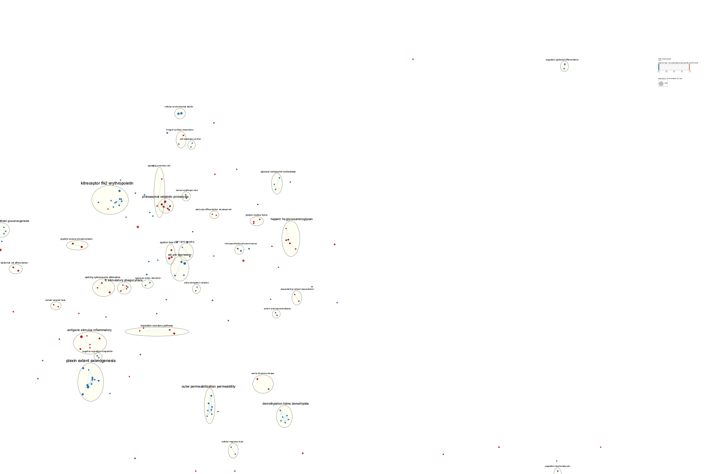
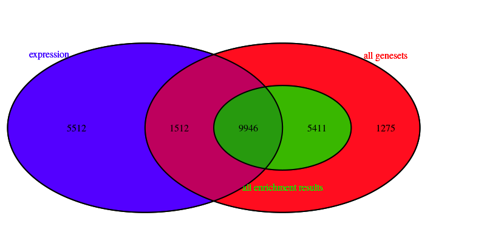

### Review of Assignment 1: data preparation and inital processing
<br>
**1. Install required packages in this assignment:**

```{r message=FALSE, results=FALSE}
if (!requireNamespace("BiocManager", quietly = TRUE)){
  install.packages("BiocManager")
  }
if (!requireNamespace("GEOmetadb", quietly = TRUE)){
  BiocManager::install("GEOmetadb")
  }
library(GEOmetadb)

#install and load all packages need in A1
if (!requireNamespace('knitr', quietly = TRUE)){
install.packages('knitr', dependencies = TRUE)}
library(knitr)

if (!requireNamespace("magrittr", quietly = TRUE)){
install.packages("magrittr")}
library(magrittr) # needs to be run every time you start R and want to use %>%

if (!requireNamespace("kableExtra", quietly = TRUE)){
install.packages("kableExtra")}
library(kableExtra)

if (!requireNamespace("ggplot2", quietly = TRUE)){
install.packages("ggplot2")}
library(ggplot2)

BiocManager::install("edgeR")
library(edgeR)

```

**2. Download the selected data with supplementary files:**
<br>
* The expression data selected is _GSE160792_. And we initial processed the data by cleaning, mapping, and normalizing.
```{r message=FALSE, results=FALSE}
#get expression data
sfiles = getGEOSuppFiles('GSE160792')
 #<Detailed cleaning and mapping process is in "Assignment1.Rmd">
#We retreive the cleaned and mapped file for normalization
if (!file.exists("kas_filtered_mapped.rds")) {
  options(knitr.duplicate.label = 'allow')
  source(purl("Assignment1.Rmd", output = tempfile()))
}
kas_exp_filtered_annot <- readRDS("kas_filtered_mapped.rds")

```

**3. Applying TMM normalization to our dataset:**
```{r}
#Create an edgeR container for RNASeq count data
#use the filtered counts and make sure it is not a data.frame but is a matrix
filtered_data_matrix <- as.matrix(kas_exp_filtered_annot[,2:7]) 
rownames(filtered_data_matrix) <- kas_exp_filtered_annot$gene_id
#give the defined groups that we are going to be comparing - cell type (siMM treated or siRR treated)
d = DGEList(counts=filtered_data_matrix, group=c("Sample_K6_I", "Sample_K6_II", "Sample_K6_III","Sample_K1_I", "Sample_K1_II", "Sample_K1_III"))
#Calculate the normalization factors
d = calcNormFactors(d)
#get the normalized data
normalized_counts <- cpm(d)
```

**4. Preparing normalized counts data: **
<br>
* The normalized data with the desired format was saved into _GSE160792_finalized_normalized_counts_2022.txt_ file.
```{r message=FALSE, warning=FALSE, results='hide'}
#add the ensembl id column and HGNC symbol.
hgnc_col <- rownames(kas_exp_filtered_annot)
normalized_counts_data <- cbind(hgnc_col, normalized_counts)
ensembl_gene_id <- kas_exp_filtered_annot$ensembl_gene_id
normalized_counts_data <- cbind(ensembl_gene_id, normalized_counts_data)
normalized_counts_data <- as.data.frame(normalized_counts_data)

#remove duplicated ensembl ids
dup_id <- normalized_counts_data$ensembl_gene_id[duplicated(normalized_counts_data$ensembl_gene_id)]
normalized_counts_data <- normalized_counts_data[which(!normalized_counts_data$ensembl_gene_id %in% dup_id),]
#convert the elements in data frame to numeric value
i <- c(3, 4, 5, 6, 7, 8) 
normalized_counts_data[ , i] <- apply(normalized_counts_data[ , i], 2, function(x) as.numeric(as.character(x)))
if (!file.exists("GSE160792_finalized_normalized_counts_2022.txt")) {
write.table(normalized_counts_data, "GSE160792_finalized_normalized_counts_2022.txt", sep="\t")
}
```
---


### Review of Assignment 2: Differential Gene expression and Preliminary ORA

**1. Install required packages in this assignment:**

```{r message=FALSE, warning=FALSE, results='hide'}
if (!requireNamespace("ComplexHeatmap", quietly = TRUE)){
  BiocManager::install("ComplexHeatmap")
}
library(ComplexHeatmap) 
library(circlize)

if (!require("kableExtra", quietly = TRUE)){
  install.packages("kableExtra")
}
library(kableExtra)

if (!require("BiocManager", quietly = TRUE))
    install.packages("BiocManager")

BiocManager::install("limma")
library(limma)

if (!require("BiocManager", quietly = TRUE))
    install.packages("BiocManager")

if (!requireNamespace("kableExtra", quietly = TRUE)){
install.packages("kableExtra")}
library(kableExtra)
```

**2. Load the data saved in Assignment 1:**
```{r message=FALSE, warning=FALSE}
normalized_counts_data <- read.table(file=file.path(getwd(),
                                   "GSE160792_finalized_normalized_counts_2022.txt"),
                                    header = TRUE,sep = "\t",
                                    stringsAsFactors = FALSE,
                                    check.names=FALSE)

kable(normalized_counts_data[1:5,1:5], type="html") 
```
**3. Visualize the data using heatmap to select the model for the differential gene expression analysis. **
```{r message=FALSE, warning=FALSE, fig.align='center', fig.dim=c(6,4)}
#Create a numerical matrix that we can create a heatmap from
heatmap_matrix <- normalized_counts_data[,3:ncol(normalized_counts_data)]
rownames(heatmap_matrix) <- normalized_counts_data$ensembl_gene_id
colnames(heatmap_matrix) <- colnames(normalized_counts_data[,3:ncol(normalized_counts_data)])

#create a heatmap
heatmap_matrix <- t(scale(t(heatmap_matrix)))
if(min(heatmap_matrix) == 0){
heatmap_col = colorRamp2(c( 0, max(heatmap_matrix)),
                         c( "white", "red"))
}else {
  heatmap_col = colorRamp2(c(min(heatmap_matrix), 0, 
                             max(heatmap_matrix)), c("blue", "white", "red"))}

current_heatmap <- Heatmap(as.matrix(heatmap_matrix),
      show_row_dend = TRUE,show_column_dend = TRUE,
      col=heatmap_col,show_column_names = TRUE,
      show_row_names = FALSE,show_heatmap_legend = TRUE)
#current_heatmap
```
**4. Construct two models --- simple and complex models to count for replicates variability.**
<br>
* The threshold was set to 0.05, which is the common threshold for p-value to indicate the significance of the expression data. P-value < 0.05 represents that the possibility to reject the null hypothesis is more than 95%.
<br>
* Use Limma to control for different variables and improve our results if we account for the replicate variability using Benjamni-hochberg during multiple hypothesis testing.
<br>
* Benjamini-Hochberg (BH) method to correct the p-value since it is a common method used in multiple hypothesis testing. BH is not overly stringent and can be used to control for the family-wise error rate and false discovery rate.
<br>
* For the model built by limma, there were **5907** genes passed the correction before the BH correction, and **3624** genes passed the correction after we applied the multiple hypothesis testing.
<br>
* For the model built by edgeR, there were **5761** genes3 passed the correction before the BH correction, and **3464** genes passed the correction after we applied the multiple hypothesis testing.
<br>
```{r message=FALSE, warning=FALSE}
#we hypothesize that RUNX1/RUNX1T1 knockdown will lead to the differential expression.
samples <- data.frame( lapply(colnames(normalized_counts_data)[3:8], FUN=function(x){
          unlist(strsplit(x, split = "\\_"))[c(3,2)]}))
rownames(samples) <- c("replicates","cell_type")
colnames(samples) <- colnames(normalized_counts_data)[3:8]
samples <- data.frame(t(samples))
samples[1:5,]

#function to create a linear model in R - model.matrix 
#creates a design matrix
model_design <- model.matrix(~ samples$cell_type )
kable(model_design[1:5,], type="html")

#Create our data matrix
expressionMatrix <- as.matrix(normalized_counts_data[,3:8])
rownames(expressionMatrix) <- normalized_counts_data$ensembl_gene_id
colnames(expressionMatrix) <- colnames(normalized_counts_data)[3:8]
minimalSet <- ExpressionSet(assayData=expressionMatrix)
#Fit our data to the above model
fit <- limma::lmFit(minimalSet, model_design)

#Apply empircal Bayes to compute differential expression for the above described model. 
fit2 <- limma::eBayes(fit,trend=TRUE) #The parameter trend=TRUE is specific to RNA-seq data.
 
topfit <- topTable(fit2,
                   coef=ncol(model_design),
                   adjust.method = "BH",
                   number = nrow(expressionMatrix))
#merge hgnc names to topfit table
output_hits <- merge(normalized_counts_data[,1:2],
                     topfit,
                     by.y=0,by.x=1,
                     all.y=TRUE)
#sort by pvalue
output_hits <- output_hits[order(output_hits$P.Value),]
kable(output_hits[1:10,2:8],type="html",row.names = FALSE)

#function to create a linear model in R - model.matrix creates a design matrix
model_design_pat <- model.matrix(~ samples$replicates + samples$cell_type)
kable(model_design_pat,type="html")

#Fit our data to the above model
fit_pat <- lmFit(minimalSet, model_design_pat)
#Apply empircal Bayes to compute differential expression for the above described model.
fit2_pat <- eBayes(fit_pat,trend=TRUE)
 
topfit_pat <- topTable(fit2_pat,
                   coef=ncol(model_design_pat),
                   adjust.method = "BH",  # we use Benjamni - hochberg for hypothesis correction
                   number = nrow(expressionMatrix))
#merge hgnc names to topfit table
output_hits_pat <- merge(normalized_counts_data[,1:2],
                         topfit_pat,by.y=0,by.x=1,all.y=TRUE)
#sort by pvalue
output_hits_pat <- output_hits_pat[order(output_hits_pat$P.Value),]
kable(output_hits_pat[1:10,2:8],type="html",row.names = FALSE)

#Set up our edgeR objects
d = DGEList(counts=filtered_data_matrix, group=samples$cell_type)
#Estimate Dispersion - our model design.
d <- estimateDisp(d, model_design_pat)
#Fit the model
fit <- glmQLFit(d, model_design_pat)
#kable(model_design_pat[1:3,1:3], type="html") %>% row_spec(0, angle = -45)
#Calculate differential expression using the Quasi liklihood model
qlf.pos_vs_neg <- glmQLFTest(fit, coef='samples$cell_typeK6')
kable(topTags(qlf.pos_vs_neg), type="html",row.names = FALSE)

#Get all the results
qlf_output_hits <- topTags(qlf.pos_vs_neg,sort.by = "PValue",
                           n = nrow(normalized_counts_data))
rownames(qlf_output_hits$table) <- normalized_counts_data$ensembl_gene_id
```

**5.Compare the results from the two different models Limma vs Quasi liklihood.**
<br>
 * From Limma and Quasi likelihood, we can observe the highlighted gene has the p-value close to 0 in both models
```{r message=FALSE, warning=FALSE, fig.align='center', echo=FALSE, out.width=c('50%', '50%'), fig.show='hold', fig.cap="Comparison of results from limma and edgeR models"}
qlf_pat_model_pvalues <- data.frame(ensembl_id = rownames(qlf_output_hits$table),
                                    qlf_patient_pvalue=qlf_output_hits$table$PValue)
limma_pat_model_pvalues <- data.frame(ensembl_id = output_hits_pat$ensembl_gene_id,
                                      limma_patient_pvalue = output_hits_pat$P.Value)
two_models_pvalues <- merge(qlf_pat_model_pvalues,
                            limma_pat_model_pvalues,
                            by.x=1,by.y=1)
two_models_pvalues$colour <- "grey"
two_models_pvalues$colour[two_models_pvalues$qlf_patient_pvalue
                          <0.05] <- "orange"
two_models_pvalues$colour[two_models_pvalues$limma_patient_pvalue
                          <0.05] <- "blue"
two_models_pvalues$colour[two_models_pvalues$qlf_patient_pvalue
                          <0.05 &
two_models_pvalues$limma_patient_pvalue<0.05] <- "red"

plot(two_models_pvalues$qlf_patient_pvalue,
     two_models_pvalues$limma_patient_pvalue,
     col = two_models_pvalues$colour,
     xlab = "QLF patient model p-values",
     ylab ="Limma Patient model p-values",
     main="QLF vs Limma")

legend(0,1,legend=c("qlf","limma","both","not sig"),
       fill=c("orange","blue","red","grey"),cex = 0.7)

#highlight the gene of interest
ensembl_of_interest <- normalized_counts_data$ensembl_gene_id[
  which(normalized_counts_data$hgnc_col == "RUNX1T1")]
two_models_pvalues$colour <- "grey"
two_models_pvalues$colour[two_models_pvalues$ensembl_id==ensembl_of_interest] <- "red"
plot(two_models_pvalues$qlf_patient_pvalue,
     two_models_pvalues$limma_patient_pvalue,
     col = two_models_pvalues$colour,
     xlab = "QLF patient model p-values",
     ylab ="Limma Patient model p-values",
     main="QLF vs Limma")
points(two_models_pvalues[
  two_models_pvalues$ensembl_id==ensembl_of_interest,2:3],
       pch=24,  col="red", cex=1.5)
```

**6. Draw volcano plot or MA plot with interested gene highlighted:**
<br>
 * Volcano plot for amount of differentially expressed genes in **replicate** model and highlight the genes of interest.<br>
  + There are clear divisons on the volcano plot. The left region indicates the expression of siRR-treated replicates with RUNX1/RUNXT1 knocked-off, while the right region indicates the expression of siMM-treated replicates with RUNX1/RUNXT1 gene. We could clearly observed that expressions for up-regulated and down-regulated genes were separated by color. And the differential expression data processed by edgeR package offered a more clear division.
```{r message=FALSE, warning=FALSE, fig.align='center', fig.cap="Figure: Kasumi-1 AML cells Volcano Plots for Replicate model"}
#To better visualize the graph, we first filtered out the genes with extremely logFC.
filtered_output_hits_pat <- output_hits_pat[which(output_hits_pat$logFC < 150 & output_hits_pat$logFC > -150),]
ensembl_of_interest <- normalized_counts_data$ensembl_gene_id[
  which(normalized_counts_data$hgnc_col == "RUNX1T1")]

df_edger <- data.frame(ensembl_gene_id = filtered_output_hits_pat$ensembl_gene_id,
                 logFC = filtered_output_hits_pat$logFC,
                 logpvalue = -log10(filtered_output_hits_pat$P.Value),
                 adj_p = filtered_output_hits_pat$adj.P.Val,
                 color="grey")
df_edger$color[which(df_edger$logFC > 0 & df_edger$adj_p < 0.05)] <- "green"
df_edger$color[which(df_edger$logFC< 0 & df_edger$adj_p < 0.05)] <- "blue"
df_edger$color[df_edger$ensembl_gene_id==ensembl_of_interest] <- "red"
p_edger <- plot(df_edger[,c(2,3)], col=df_edger$color, main = "Volcano plot for P-value and LogFoldChange Calculated by edgeR method")

points(filtered_output_hits_pat[which(
  filtered_output_hits_pat$ensembl_gene_id == ensembl_of_interest),2:3],
       pch=20, col="red", cex=1.5)
legend("topright", 
       legend=c("up-regulated", "down-regulated", "rest", "gene of interest"), 
       fill = c("blue","green", "grey", "red"),
       cex = 0.7)
```
<br>

**7. Visualize the top hits obtained by limma use a heatmap**
* Order the heatmap obtain by results from limma by knock-off genes<br>
* Set p_value threshold < 0.01 to get more cleaner picture<br>
```{r message=FALSE, warning=FALSE, fig.align='center', fig.cap="Heatmap of Tophits (p-value<0.01) of Gene expressions ordered by knockdown genes"}
top_hits <- output_hits_pat$ensembl_gene_id[output_hits_pat$P.Value<0.01]
heatmap_matrix_tophits <- t(
scale(t(heatmap_matrix[which(rownames(heatmap_matrix) %in% top_hits),])))
heatmap_matrix_tophits<- heatmap_matrix_tophits[,
       c(grep(colnames(heatmap_matrix_tophits),pattern = "?K6"),
         grep(colnames(heatmap_matrix_tophits),pattern = "?K1"))]
if(min(heatmap_matrix_tophits) == 0){
heatmap_col = colorRamp2(c( 0, max(heatmap_matrix_tophits)),
                             c( "white", "red"))
} else {
heatmap_col = colorRamp2(c(min(heatmap_matrix_tophits), 0,
                              max(heatmap_matrix_tophits)),
                             c("blue", "white", "red"))
}
ordered_restricted_tophits_heatmap <- Heatmap(as.matrix(heatmap_matrix_tophits),
                cluster_rows = TRUE,  show_row_dend = TRUE,
                cluster_columns = FALSE,show_column_dend = FALSE,
                col=heatmap_col,show_column_names = TRUE,
                show_row_names = FALSE,show_heatmap_legend = TRUE)

ordered_restricted_tophits_heatmap

```
* The results from limma showed clusters of siRR-treated samples and siMM-treated samples, indicating that RUNX1/RUNXT1 plays an essential role in regulating the cell physiological process.

**8. Threshold over-representation analysis.**
```{r message=FALSE, warning=FALSE}
#Create thresholded lists of genes.
#merge gene names with the top hits
qlf_output_hits_withgn <- merge(normalized_counts_data[,1:2], qlf_output_hits, by.x=1, by.y=0)

qlf_output_hits_withgn[,"rank"] <- -log(qlf_output_hits_withgn$PValue, base=10)*sign(qlf_output_hits_withgn$logFC)
qlf_output_hits_withgn <- qlf_output_hits_withgn[order(qlf_output_hits_withgn$rank),]

upregulated_genes <- qlf_output_hits_withgn$hgnc_col[
  which(qlf_output_hits_withgn$PValue < 0.05 & qlf_output_hits_withgn$logFC > 0)]
downregulated_genes <- qlf_output_hits_withgn$hgnc_col[
  which(qlf_output_hits_withgn$PValue < 0.05 & qlf_output_hits_withgn$logFC < 0)]

write.table(x=upregulated_genes,
            file=file.path("~/projects/Desktop/Xiaolin/data","AML_upregulated_genes.txt"),sep="\t",
            row.names = FALSE,col.names = FALSE,quote = FALSE)
write.table(x=downregulated_genes,
            file=file.path("data","AML_downregulated_genes.txt"),sep="\t",
            row.names = FALSE,col.names = FALSE,quote = FALSE)
write.table(x=data.frame(genename= qlf_output_hits_withgn$hgnc_col,F_stat=qlf_output_hits_withgn$rank),
            file=file.path("data","AML_ranked_genelist.txt"),sep = "\t",
            row.names = FALSE,col.names = FALSE,quote = FALSE)

sig_differential_expressed <- qlf_output_hits_withgn$hgnc_col[
  which(qlf_output_hits_withgn$PValue < 0.05)]  
write.table(x=sig_differential_expressed,
            file=file.path("data","AML_complete_genelist.txt"),sep = "\t",
            row.names = FALSE,col.names = FALSE,quote = FALSE)
            
```
 * g:profiler was chosen to do the analysis since it is a well-known web server for gene enrichment analysis and it includes more than 9 annotation gene sets, such as GO and KEGG.The p-value threshold used was 0.05.
 * Used g:profiler to query above gene lists:
  + Resources: GO biological process, Reactome, and WikiPathways.
  + Advanced options: Benjamini–Hochberg FDR, 0.05 threldshold.
 * The results of the threshold analysis are:
    + Results from up_regulated genes list:
```{r results='asis', echo=FALSE}
#The top term returned in each data source:
data_resource = c("Go: BP", "REAC", "WP")
top_terms = c("cellular macromolecule metabolic process", 
              "RHO GTPase cycle", 
              "TNF-alpha signaling pathway")
t = c(5746,444,94)
q = c(2544,1718,1247)
t_intersect_q = c(1056, 107, 32)
df_up = data.frame(data_resource, top_terms, t, q, t_intersect_q)
colnames(df_up) = c("Data source", "Top Term", "T", "Q", "T intersect Q")
kable(df_up, format = 'html',  escape=FALSE,align=c(rep('c',times=5)))%>%
  kable_styling(full_width = F)
```
<br>
  + Results from down_regulated genes list:
```{r results='asis', echo=FALSE}
#The top term returned in each data source:
data_resource = c("Go: BP", "REAC", "WP")
top_terms = c("cellular macromolecule metabolic process", 
              "Metabolism of RNA", 
              "DNA repair pathways, full network")
t = c(5746,661,120)
q = c(3144,2126,1524)
t_intersect_q = c(1269, 195, 46)
df_down = data.frame(data_resource, top_terms, t, q, t_intersect_q)
colnames(df_down) = c("Data source", "Top Term", "T", "Q", "T intersect Q")
kable(df_down, format = 'html',  escape=FALSE,align=c(rep('c',times=5)))%>%
  kable_styling(full_width = F)
```
<br>

  +  Results for all differentially expressed genes:
```{r results='asis', echo=FALSE}
#The top term returned in each data source:
data_resource = c("Go: BP", "REAC", "WP")
top_terms = c("cellular macromolecule metabolic process", 
              "Metabolism of RNA", 
              "Cell cycle")
t = c(5746,661,122)
q = c(5694,3848,2772)
t_intersect_q = c(2327, 345, 75)
df_all = data.frame(data_resource, top_terms, t, q, t_intersect_q)
colnames(df_all) = c("Data source", "Top Term", "T", "Q", "T intersect Q")
kable(df_all, format = 'html',  escape=FALSE,align=c(rep('c',times=5)))%>%
  kable_styling(full_width = F)
```
<br> 
 * The screenshot results from g:Profiler:

  - [up-regulated overview](data/gProfiler_upregulated.png)
  - [up-regulated details](data/gProfiler_upregulated_details.png)
  - [down-regulated overview](data/gProfiler_downregulated.png)
  - [down-regulated details](data/gProfiler_downregulated_details.png)
  - [complete list overview](data/gProfiler_complete_gene_list.png)
  - [complete list details](data/gProfiler_complete_gene_list_details.png)
<br>  
  
  
---

### Assignment 3: Non-thresholded Gene set Enrichment Analysis
<br>
**Conduct non-thresholded gene set enrichment analysis using the ranked set of genes from Assignment #2.**<br>
 * This enrichment analysis was conducted using external GESA application. The result of the following analysis is [here](data/gsea_results/index.html)<br>
 * The ranked list created in Assignment 2 was used as the input for the non-threshold gene sets enrichment analysis.<br>
 *  Convert the text file into desirable format (.rnk):
```{r warning=FALSE, results='hide', message=FALSE}
ranked_gene_list <- read.delim("data/AML_ranked_genelist.txt", header = FALSE)
write.table(x=ranked_gene_list, file=file.path("data","AML_ranked_genelist.rnk"),sep = "\t", 
            row.names = FALSE,col.names = c('GeneName','rank'),quote = FALSE)
```
 * The geneset used in this enrichment analysis was **Human_GOBP_AllPathways_no_GO_iea_April_01_2022_symbol.gmt** from the baderlab geneset collection from April 1, 2022 containing GO biological process, no IEA and pathways.
```{r message=FALSE, warning=FALSE, results='hide'}
if (!requireNamespace("RCurl", quietly = TRUE)){
  install.packages("RCurl")
  }
library(RCurl)

# go to the current_release for finding the latest genesets for human
gmt_current_release = "http://download.baderlab.org/EM_Genesets/current_release/Human/symbol/"
filenames = RCurl::getURL(gmt_current_release)
tc = textConnection(filenames)
contents = readLines(tc)
close(tc)
rx = gregexpr("(?<=<a href=\")(.*.GOBP_AllPathways_no_GO_iea.*.)(.gmt)(?=\">)",
              contents, perl = TRUE)
gmt_file = unlist(regmatches(contents, rx))
dest <- file.path(paste(getwd(),'data', sep="/"),gmt_file)
download.file(paste(gmt_current_release, gmt_file, sep=""), destfile=dest)
```
 * The parameters set in GSEA analysis:
  ** Maximum geneset size = 200
  ** Minimum geneset size = 15
  ** Gene set permutation = 1000
  ** Collapse/Remap tp gene symbol: No collapse

---

#### Interpretation of the GSEA results
**1. What method did you use? What genesets did you use? Make sure to specify versions and cite your methods.**<br>
 * Method: **Gene Set Enrichment Analysis (GSEA)** was used for determining whether an a priori defined set of genes shows statistically significant, concordant differences between two biological states (e.g. phenotypes) (Subramanian, Tamayo et al., 2005; Mootha, Lindgren et al., 2003). 
 <br>
 * Genesets: Genesets from the baderlab geneset collection from current release (April, 01, 2022) containing GO biological process, no IEA and pathways. The data can be retrieved [here](http://download.baderlab.org/EM_Genesets/current_release/Human/symbol/Human_GOBP_AllPathways_no_GO_iea_April_01_2022_symbol.gmt).
 <br>
 
**2. Summarize your enrichment results.**
* Top return for **negative** subtype: REGULATION OF MEMBRANE PERMEABILITY%GOBP%GO:0090559
 + The information of top gene set returned for the **negative** (down-regulated) subtype: pvalue = 0.00, ES = -0.65, NES = -1.82, FDR = 1.00
 + Number of genes in its leading edge: 44
 + The top gene associated with this geneset: MUL1
* Top return for **postive** (up-regulated)subtype: NEGATIVE REGULATION OF INFLAMMATORY RESPONSE TO ANTIGENIC STIMULUS%GOBP%GO:0002862
 + The information of top gene set returned for the **positive** subtype: pvalue = 0.002, ES = 0.77, NES = 1.80, FDR = 1.00
 + Number of genes in its leading edge: 16
 + The top gene associated with this geneset: FGR

**3. How do these results compare to the results from the thresholded analysis in Assignment #2. Compare qualitatively. Is this a straight forward comparison? Why or why not?**
* The leading genes returned in this non-threshold analysis were relevant but not identical to top genes returned in the threshold analysis performed in Assignment2. 
* The 7th leading return in the **negative** subtype (NEGATIVE REGULATION OF CELLULAR CARBOHYDRATE METABOLIC PROCESS%GOBP%GO:0010677) in the non-threshold analysis is similar to the top return (cellular macromolecule metabolic process GO:BP) in the down-regulated genes in threshold analysis. Also, the 16th return in the **negative** subtype (POSITIVE REGULATION OF MEMBRANE PERMEABILITY%GOBP%GO:1905710) and the 22th top return in down-regulated threshold analysis both mention the positive regulation of the cellular process.
* The 5th leading return in the **positive** subtype (FC RECEPTOR SIGNALING PATHWAY%GOBP%GO:0038093) in the non-threshold analysis is associated with the top return in the Wikipathway top return by threshold analysis (TNF-alpha signaling pathway). The TNF-alpha is an inflammatory cytokine produced by macrophages/monocytes during acute inflammation. It is also known as the Fc-Fusion. the binding of monoclonal antibodies to membrane TNF on activated T cells will induce macrophages, which followed by the recognition of the Fc region of the monoclonal antibodies by Fc receptors [FcR] expressed on monocytes.
* The comparison is straightforward. The input data for non-threshold analysis has the same gene list as the normalized data for threshold analysis, except for the ranking information. And the parameters were the same for both analysis.
<br>

---

### Visualize your Gene set Enrichment Analysis in Cytoscape
Using your results from your non-thresholded gene set enrichment analysis visualize your results in **Cytoscape** ( Institute for Systems Biology, 2019). 
<br>
1. **Create an enrichment map** - how many nodes and how many edges in the resulting map? What thresholds were used to create this map? Make sure to record all thresholds. Include a screenshot of your network prior to manual layout.
  * Cytoscape **3.9.1** and EnrichmentMap Cytoscape App **3.3.3**  were used to create the encrichment map.
  * The parameter set for generating the map:
   - p_value = 0.05
   - FDR q_value = 0.9
   - edge cutoff = 0.375
   
  * **190** nodes (genesets) and **170** edges (overlaps between each pair of the genesets) were drawn.
  * The picture of the network is [here](data/AML_GSEA_enrichmentmap.png)

2. **Annotate your network** - what parameters did you use to annotate the network. If you are using the default parameters make sure to list them as well.
 * The annotation of the network was using Cytoscape implemented with AutoAnnotate App 1.3.5 (bader, 2016).
 * The parameters were set as:
  - Cluster algorithm: MCL Cluster Annotation Set
  - Label column: GS_DESCR
  - Layout newtwork to prevent cluster overlap: Selected
 * The picture of the annotated network is [here](data/Annotated_Network.png)
 
 
3. **Make a publication ready figure** - include this figure with proper legends in your notebook.
* The publication ready figure:
```{r echo=FALSE, fig.cap="Figure 1.: Publication ready figure for enrichment analysis", out.width = '100%', fig.align='center'}

```
* The full size of picture: [Publication-ready Figure](data/Publication-ready.png)


4. **Collapse your network to a theme network.** What are the major themes present in this analysis? Do they fit with the model? Are there any novel pathways or themes?
* The major themes in the annotated network are kitreceptor flk2 erythropoietin, plexin extent axonogenesis, outer permeabilization permeability, demethylation hdms demethylate, and proteasomal catabolic proteolysis. <br>
* Among these major biological themes,the two largest clusters for **down-regulated genesets** are: **kitreceptor flk2 erythropoietin** and **plexin extent axonogenesis**, which contain 11 and 10 nodes respectively.<br>
* Among these major biological themes,the two largest clusters for **up-regulated genesets** is: **proteasomal catabolic proteolysis** and **antigenic stimulus inflammatory**, which contain 6 and 5 nodes respectively.<br>
* The major themes for up-regulated genes are included in the results from ORA by g:profiler. g:profiler top hits for up-regulated genes are related to various metabolic process, including organonitrogen compound metabolic process, cellular protein metabolic process, and protein metabolic process. In the major themes, the proteasomal catabolic proteolysis involves chemical reactions and pathways resulting in the breakdown of a protein or peptide by hydrolysis of its peptide bonds that is mediated by the proteasome (Bult, 2019). This catabolism is the subset of metabolic pathways to break down molecules into smaller units. So the top results from the up-regulated theme network are included in the GO:BP results from the previous model constructed by threshold analysis.<br>
* Yes, there are novel themes present in the theme network. **plexin extent axonogenesis** is one of the themes that not present in the threshold analysis results.
<br>

---

### Interpretation and detailed view of results
**The most important aspect of the analysis is relating the results back to the initial data and question.**

 1. Do the enrichment results support conclusions or mechanism discussed in the original paper? How do these results differ from the results you got from Assignment #2 threshold methods
 * The original paper conducted the differential expression analysis and the enrichment analysis with the protein from up-regulated and down-regulated, and non-differentially expressed RNA isoforms. The Enrichmen map indicates the up-regulated genesets are functionally related to the regulation of stress response, regulation of cellular differentiation and development, and signal transduction. Similarly, in our clusters, there are genesets associated with signalling promotes cell and regulation f secretory pathways. For the down-regulated genesets, the functions are related to regulation of cellular physiological process, plasma membrane and cell peripheral, which is similar to our GSEA result since the major clusters also relate to the outer permeabilization permeability of membrane. Moreover, the paper claims that GSEA shows that  knockdown of RUNX1/RUNX1T1 affects RNA binding proteins and snRNP assembly, and is associated with impaired mRNA processing and, in particular, splicing pathways. One of our clusters can act as spliceosome to trigger splicing. 
 * However, our top clusters are related to hormone for haematopoietic stem cell differentiation, which is only mentioned in the original paper by differential expression analysis. 
 <br>
 2. Can you find evidence, i.e. publications, to support some of the results that you see. How does this evidence support your result?
 * The leading cluster in the annotated enrichment map has the function as kitreceptor flk2 erythropoietin. But the original paper does not mention this. Among all genes in this cluster, we find the TCR group has the largest node, indicating it has the most number of genesets contribute to this. RUNX1 is a well-known transcription factor for T-cell differentiation. From Seitz's study in 2020, RUNX1 plays a role as recombinase co-factor for TCR-beta rearrangements and pathological deletions. Therefore, the knockdown of the RUNX1/RUNX1T1 could influence the function of TCR in the major cluster.
<br> 

Using your networks and results from the previous section add one of the following:
3. Sometimes the most interesting information is the gene that has no information. In this type of pathway analysis we can only discover what we have already described previously in the literature or pathway databases. Often pathways found in one disease are applicable to other diseases so this technique can be very helpful. It is important to highlight any genes that are significantly differentially expressed in your model but are not annotated to any pathways. We refer to this set of genes as the dark matter. <br>
 * Include a heatmap of any significant genes that are not annotated to any of the pathways returned in the enrichment analysis. <br>
 * Include a heatmap of any significant genes that are not annotated to any pathways in entire set of pathways used for the analysis. <br>
1. Load the files needed for dark matter analysis
```{r warning=FALSE, message=FALSE}
#load genesets used in the previous enrichment analysis - gmt file.
if (!requireNamespace("GSA", quietly = TRUE)){
  install.packages("GSA")
  }
library(GSA)
gmt_file <- file.path(getwd(),"data",
  "Human_GOBP_AllPathways_no_GO_iea_April_01_2022_symbol.gmt")
capture.output(genesets<- GSA.read.gmt(gmt_file),file="gsa_load.out")
names(genesets$genesets) <- genesets$geneset.names

#load the expression and rank file
expression <- readRDS("kas_filtered_mapped.rds")
ranks <- read.table(file.path(getwd(),"data","AML_ranked_genelist.txt"),
                    header = TRUE, sep = "\t", quote="\"",
                    stringsAsFactors = FALSE)
#get GSEA results files - the na_pos and na_neg spreadsheets in GSEA results directories
#get all the GSEA directories
gsea_directories <- list.files(path = file.path(getwd(),"data"),
                                 pattern = "\\.GseaPreranked")
if(length(gsea_directories) == 1){
  gsea_dir <- file.path(getwd(),"data",gsea_directories[1]) #get the gsea result files
  gsea_results_files <- list.files(path = gsea_dir, pattern = "gsea_report_*.*.tsv") #there should be 2 gsea results
  enr_file1 <- read.table(file.path(gsea_dir,gsea_results_files[1]),
                          header = TRUE, sep = "\t", quote="\"",
                          stringsAsFactors = FALSE,row.names=1)
  enr_file2 <- read.table(file.path(gsea_dir,gsea_results_files[1]), 
                          header = TRUE, sep = "\t", 
                          quote="\"",stringsAsFactors = FALSE,row.names=1)
}

```
2. Collect the data used to calculate the dark matter from the loaded files.
* all genes in the expression set - already loaded above 
* all genes in the enrichment results
* all genes in the significant enriched results
* all genes in geneset file 
```{r warning=FALSE, message=FALSE}
#get the genes from significant enriched results with threshold set to 0.01
FDR_threshold <- 1.0
all_sig_enriched_genesets <- c(rownames(enr_file1)[which(enr_file1[,"FDR.q.val"]<=FDR_threshold)], rownames(enr_file2)[which(enr_file2[,"FDR.q.val"]<=FDR_threshold)]) 
genes_sig_enriched_gs <- c()
for(i in 1:length(all_sig_enriched_genesets)){
  current_geneset <- unlist(genesets$genesets[which(genesets$geneset.names %in% all_sig_enriched_genesets[i])])
  genes_sig_enriched_gs <- union(genes_sig_enriched_gs, current_geneset)
}
#get genes from geneset file
genes_all_gs <- unique(unlist(genesets$genesets))
```

3. Use Venn Diagram to show the dark matter overlaps
```{r message=FALSE, warning=FALSE, results='hide'}
if (!requireNamespace("VennDiagram", quietly = TRUE)){
  install.packages("VennDiagram")
  }
library(VennDiagram)

A <- genes_all_gs # all genes in the gmt file
B <- genes_sig_enriched_gs # all genes in the enrichment result
C <- rownames(expression) # all genes in the expression
venn_path <- file.path(getwd(),"data","dark_matter_overlaps.png")
png(venn_path)
draw.triple.venn( area1=length(A), area2=length(B), area3 = length(C),
                  n12 = length(intersect(A,B)), n13=length(intersect(A,C)),
                  n23 = length(intersect(B,C)), 
                  n123 = length(intersect(A,intersect(B,C))),
                  category = c("all genesets","all enrichment results","expression"),
                  fill = c("red","green","blue"),
                  cat.col = c("red","green","blue"))
#grid.draw(p)
#grid.newpage()
dev.off()
```

```{r echo=FALSE, fig.cap="Figure Dark Matter", fig.align='center', fig.cap="Figure 2: Venn diagram of Dark Matter Overlap."}

```

4. Get the set of genes that have no annotation and search the top returns on the Uniprot.
```{r dark_matter4, warning=FALSE, message=FALSE, out.width="100%"}
if (!requireNamespace("magrittr", quietly = TRUE)){
install.packages("magrittr")}
library(magrittr) # needs to be run every time you start R and want to use %>%
if (!requireNamespace("kableExtra", quietly = TRUE)){
install.packages("kableExtra")}
library(kableExtra)

genes_no_annotation <- setdiff(rownames(expression), genes_all_gs) 
length(genes_no_annotation) #5512
#Get the top ranked genes that have no annotation
ranked_gene_no_annotation <- ranks[which(ranks[,1] %in% genes_no_annotation),]
kable(ranked_gene_no_annotation[1:10,], format = 'html', caption = "Table 1: Top 10 ranked genes with no annotation", col.names = c("Gene","Rank score"), escape=FALSE,align=c(rep('c',times=2))) %>% kable_styling(full_width = T)
```
 * Note: The top gene returned with the highest rank is **C1orf112**. By searching on the Uniprot, we found this gene is associated with Uncharacterized protein C1orf112. This gene is annotated in **Enzyme and pathway databases**, which is not included in our database. Moreover, from the further search, the top three are annotated in the same database, which makes the not annotated in our analysis.
 * From the study, the **C1orf112** is one of the two novel fusion partners of RUNX1 in acute myeloid leukemia (Guastadisegni, 2010), which is the cell analysed in this paper. And the expression of this gene might significantly influence the results, so we should include the Enzyme and pathway databases for more refined analysis.

<br>

### Heatmaps of genes without annotation in the enrichment analysis and in the entire set of pathways used for the analysis.
 * Heatmap of any significant genes that are not annotated to any of the pathways returned in the enrichment analysis.
```{r warning=FALSE, message=FALSE}
# genes without annotation and in enrichment analysis
genes_no_ann_enr <- setdiff(C, B)
# the green area
length(genes_no_ann_enr)
ranked_genes_no_ann_enr <- ranks[which(ranks[,1] %in% genes_no_ann_enr),]
kable(ranked_genes_no_ann_enr[1:5,], format = 'html', caption = "Table 2: The Top 10 ranked genes without annotation returned in enrichment analysis", col.names = c("Gene","Rank score"), escape=FALSE,align=c(rep('c',times=2)))%>%kable_styling(full_width = T)
```
<br>

```{r warning=FALSE, message=FALSE, fig.cap="Figure 11: Heatmap for genes without annotation returned in enrichment results", fig.align='center'}
#ranked_genes_no_ann_enr_matrix <-  t(scale(t(expression[rownames(expression) %in% ranked_genes_no_ann_enr[,1],])))

ranked_genes_no_ann_enr_matrix <- expression[which(rownames(expression) %in% ranked_genes_no_ann_enr[,1]),][,-1]
ranked_genes_no_ann_enr_matrix <- data.frame(apply(ranked_genes_no_ann_enr_matrix, 2, function(x) as.numeric(x)))
genes_no_annotation_matrix <- t(scale(t(ranked_genes_no_ann_enr_matrix)))


if(min(genes_no_annotation_matrix) == 0){
  heatmap_col = colorRamp2(c( 0, max(genes_no_annotation_matrix)),
                           c( "white", "red"))
} else {
  heatmap_col = colorRamp2(c(min(genes_no_annotation_matrix), 0,
                             max(genes_no_annotation_matrix)), 
                           c("blue", "white", "red"))
}
heatmap1 <- Heatmap(as.matrix(genes_no_annotation_matrix),
                              cluster_rows = TRUE,
                              cluster_columns = TRUE,
                              show_row_dend = TRUE,
                              show_column_dend = TRUE,
                              col=heatmap_col,
                              show_column_names = TRUE,
                              show_row_names = FALSE,
                              show_heatmap_legend = TRUE,
                              column_title = "Samples", 
                              row_title = "Genes")
heatmap1
```
<br>

* Heatmap of any significant genes that are not annotated to any pathways in entire set of pathways used for the analysis.
```{r message=FALSE, warning=FALSE, fig.cap="Figure: Heatmap of genes without annotation",fig.align='center'}

colnames(expression) <- lapply(colnames(expression),
                               FUN=function(x){unlist(strsplit(x, split = "-")[[1]][1])})
expression_matrix <- expression[which(rownames(expression) %in% ranked_gene_no_annotation[,1]),][,-1]
expression_matrix <- data.frame(apply(expression_matrix, 2, function(x) as.numeric(x)))
genes_no_annotation_matrix <- t(scale(t(expression_matrix)))
if(min(genes_no_annotation_matrix) == 0){
  heatmap_col = colorRamp2(c( 0, max(genes_no_annotation_matrix)),
                           c( "white", "red"))
} else {
  heatmap_col = colorRamp2(c(min(genes_no_annotation_matrix), 0,
                             max(genes_no_annotation_matrix)), 
                           c("blue", "white", "red"))
}
heatmap2 <- Heatmap(as.matrix(genes_no_annotation_matrix),
                              cluster_rows = TRUE,
                              cluster_columns = TRUE,
                              show_row_dend = TRUE,
                              show_column_dend = TRUE,
                              col=heatmap_col,
                              show_column_names = TRUE,
                              show_row_names = FALSE,
                              show_heatmap_legend = TRUE,
                              column_title = "Samples", 
                              row_title = "Genes")
heatmap2
```
---

### Reference:
1. Subramanian, A., Tamayo, P., Mootha, V. K., Mukherjee, S., Ebert, B. L., Gillette, M. A., Paulovich, A., Pomeroy, S. L., Golub, T. R., Lander, E. S., & Mesirov, J. P. (2005). Gene set enrichment analysis: a knowledge-based approach for interpreting genome-wide expression profiles. Proceedings of the National Academy of Sciences of the United States of America, 102(43), 15545–15550. https://doi.org/10.1073/pnas.0506580102
2. Mootha, V., Lindgren, C., Eriksson, KF. et al. PGC-1α-responsive genes involved in oxidative phosphorylation are coordinately downregulated in human diabetes. Nat Genet 34, 267–273 (2003). https://doi.org/10.1038/ng1180
3. Isserlin, R. (2021). Lecture 10: Recap and GSEA. BCB420 - Computational System Biology. Retrieved March, 21, 2022. 
4. Subramanian, A., Tamayo, P., Mootha, V. K., Mukherjee, S., Ebert, B. L., Gillette, M. A., Paulovich, A., Pomeroy, S. L., Golub, T. R., Lander, E. S., & Mesirov, J. P. (2005). Gene set enrichment analysis: a knowledge-based approach for interpreting genome-wide expression profiles. Proceedings of the National Academy of Sciences of the United States of America, 102(43), 15545–15550. https://doi.org/10.1073/pnas.0506580102
5. Institute for Systems Biology, 2019. Cytoscape, Available at: https://www.cytoscape.org.
6.Bult C. J., Blake J. A., Smith C. L., Kadin J. A., Richardson J. E. (2019). proteasomal protein catabolic process. Proteasomal protein catabolic process gene ontology term (GO:0010498). Retrieved April 5, 2022, from http://www.informatics.jax.org/vocab/gene_ontology/GO:0010498 
7. Seitz, V., Kleo, K., Dröge, A., Schaper, S., Elezkurtaj, S., Bedjaoui, N., Dimitrova, L., Sommerfeld, A., Berg, E., von der Wall, E., Müller, U., Joosten, M., Lenze, D., Heimesaat, M. M., Baldus, C., Zinser, C., Cieslak, A., Macintyre, E., Stocking, C., Hennig, S., … Hummel, M. (2020). Evidence for a role of RUNX1 as recombinase cofactor for TCRβ rearrangements and pathological deletions in ETV6-RUNX1 ALL. Scientific reports, 10(1), 10024. https://doi.org/10.1038/s41598-020-65744-0
8. Guastadisegni, M. C., Lonoce, A., Impera, L., Di Terlizzi, F., Fugazza, G., Aliano, S., Grasso, R., Cluzeau, T., Raynaud, S., Rocchi, M., & Storlazzi, C. T. (2010). CBFA2T2 and C20orf112: two novel fusion partners of RUNX1 in acute myeloid leukemia. Leukemia, 24(8), 1516–1519. https://doi.org/10.1038/leu.2010.106


